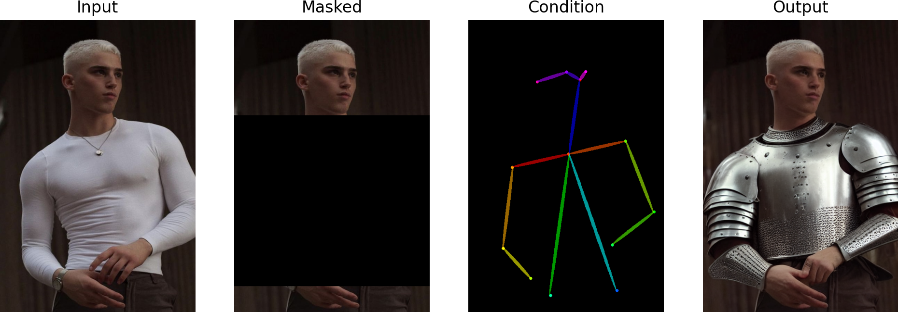

# :recycle: ControlNetInpaint

[ControlNet](https://github.com/lllyasviel/ControlNet) has proven to be a great tool for guiding StableDiffusion models with image-based hints! But what about **changing only a part of the image** based on that hint?

:crystal_ball: The initial set of models of ControlNet were not trained to work with StableDiffusion inpainting backbone, but it turns out that the results can be pretty good!

In this repository, you will find a basic example notebook that shows how this can work. **The key trick is to use the right value of the parameter** `controlnet_conditioning_scale` - while value of `1.0` often works well, it is sometimes beneficial to bring it down a bit when the controlling image does not fit the selected text prompt very well.

## Usage
Here's an example of how this new pipeline (`StableDiffusionControlNetInpaintPipeline`) is used with the core backbone of `"runwayml/stable-diffusion-inpainting"`:
```python
# load control net and stable diffusion v1-5
controlnet = ControlNetModel.from_pretrained("lllyasviel/sd-controlnet-canny", torch_dtype=torch.float16)
pipe = StableDiffusionControlNetInpaintPipeline.from_pretrained(
     "runwayml/stable-diffusion-inpainting", controlnet=controlnet, torch_dtype=torch.float16
 )

# speed up diffusion process with faster scheduler and memory optimization
pipe.scheduler = UniPCMultistepScheduler.from_config(pipe.scheduler.config)
# remove following line if xformers is not installed
pipe.enable_xformers_memory_efficient_attention()

pipe.to('cuda')

# generate image
generator = torch.manual_seed(0)
new_image = pipe(
    text_prompt,
    num_inference_steps=20,
    generator=generator,
    image=image,
    control_image=canny_image,
    mask_image=mask_image
).images[0]
```
(Full example how to get images and run the results is available in the notebook!)

## Results
All results below have been generated using the `ControlNet-with-Inpaint-Demo.ipynb` notebook.

Let's start with turning a dog into a red panda!
### Canny Edge
**Prompt**: *"a red panda sitting on a bench"*


### HED
**Prompt**: *"a red panda sitting on a bench"*


### Scribble
**Prompt**: *"a red panda sitting on a bench"*


### Depth
**Prompt**: *"a red panda sitting on a bench"*


### Normal
**Prompt**: *"a red panda sitting on a bench"*


For the remaining modalities, the panda example doesn't really make much sense, so we use different images and prompts to illustrate the capability!

### M-LSD
**Prompt**: *"an image of a room with a city skyline view"*


### OpenPose
**Prompt**: *"a man in a knight armor"*



### Segmentation Mask
**Prompt**: *"a pink eerie scary house"*


